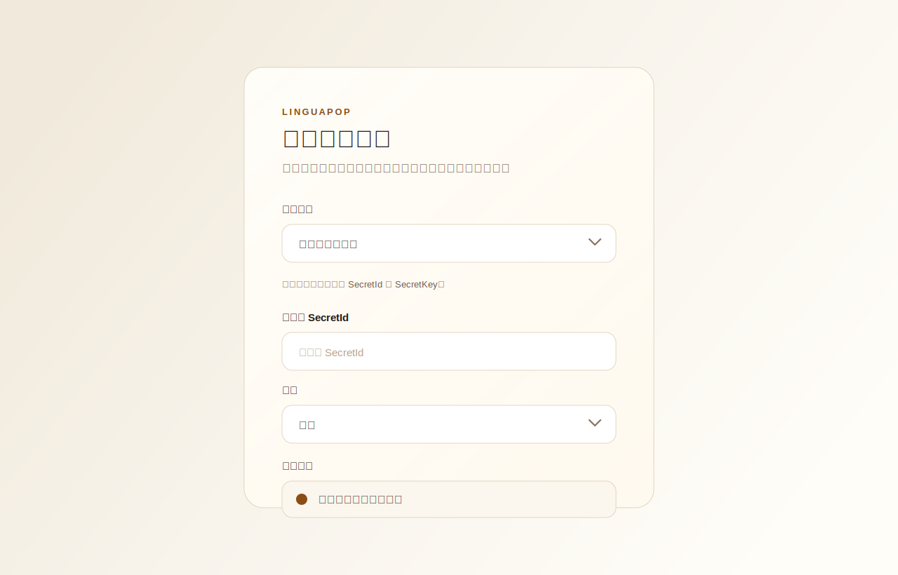
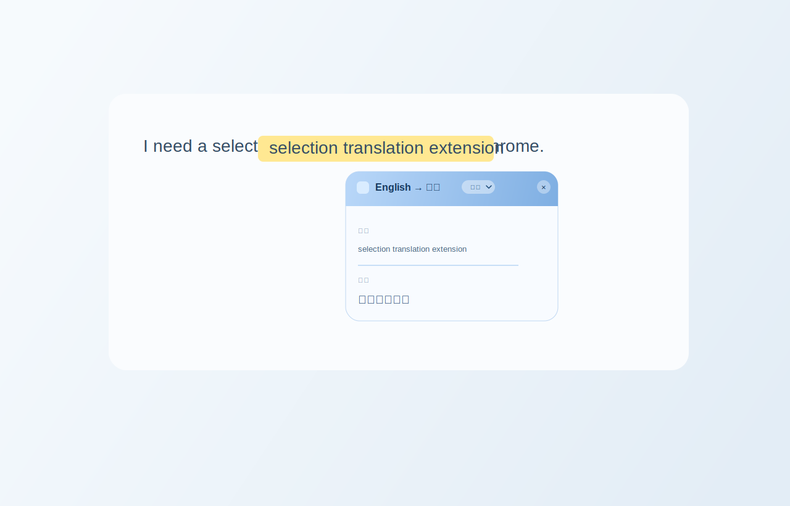
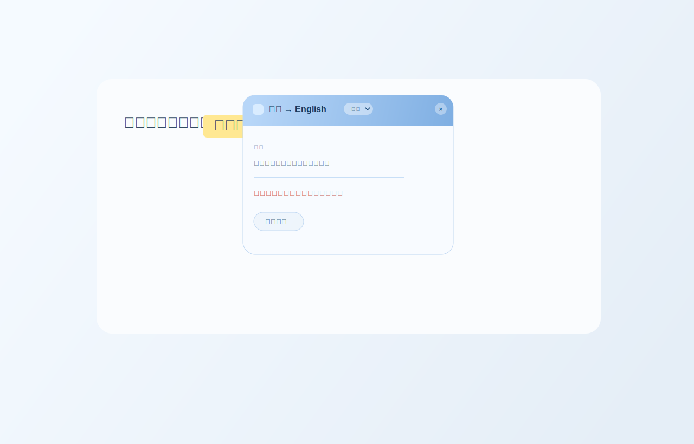

# LinguaPop

一个基于 Chrome Manifest V3 的划词翻译插件，支持网页划词、右键菜单和弹窗内切换翻译平台。

> 当前版本程序由 OpenAI Codex 协助编写与迭代。

## 功能概览

- 划词后默认自动翻译
- 可切换为“小按钮触发”模式
- 支持右键菜单“翻译所选内容”
- 支持 `腾讯云机器翻译`、`百度翻译`、`谷歌（实验性）`
- 弹窗内可直接切换翻译平台，下次划词沿用新的默认平台
- 自动处理中英方向，至少覆盖 `中文 -> English` 与 `English -> 中文`
- 可设置母语，默认 `中文`
- 命中母语时默认不发起翻译请求，避免浪费 API
- 命中母语后可手动点 `继续翻译`，只放行当前这一次
- 弹窗支持拖动
- 弹窗内可再次选中文本复制，不会重复触发翻译
- 可自定义最大选中文本长度，默认 `5000` 字符，最高 `20000` 字符
- 长文本会在后台分段翻译后合并结果
- 点击浏览器工具栏中的 LinguaPop 图标可直接打开设置页
- 自带扩展图标、Logo 和基础 README 配图

## 安装使用

LinguaPop 当前不走 Chrome Web Store，推荐直接从 GitHub Releases 下载并自行安装。

1. 打开项目的 Releases 页面：`https://github.com/xiaomohaa/LinguaPop/releases`
2. 下载最新的发布包，比如 `linguapop-1.0.1.zip`
3. 将 zip 解压到一个固定目录
4. 打开 Chrome 扩展管理页：`chrome://extensions`
5. 打开右上角 `开发者模式`
6. 点击 `加载已解压的扩展程序`
7. 选择刚刚解压后的 LinguaPop 目录
8. 加载完成后，点击浏览器工具栏中的 LinguaPop 图标进入设置页

## 如何使用

1. 点击浏览器工具栏中的 LinguaPop 图标，进入设置页
2. 选择翻译平台
3. 如果选择 `腾讯云机器翻译`，填写 `SecretId`、`SecretKey`、`Region`、`ProjectId`
4. 如果选择 `百度翻译`，填写 `App ID` 和 `Secret Key`
5. 如果选择 `谷歌（实验性）`，不需要填写凭证，但稳定性不保证
6. 设置 `母语`，默认是 `中文`
7. 设置最大选中文本长度，默认是 `5000`
8. 选择触发方式：`自动弹窗` 或 `小按钮触发`
9. 在普通网页中选中文本
10. 默认模式下会直接显示翻译弹窗；小按钮模式下先点 `译` 按钮再翻译
11. 如果命中母语拦截，弹窗会提示未发起翻译，并提供 `继续翻译` 按钮
12. 也可以通过网页右键菜单 `翻译所选内容` 触发翻译
13. 弹窗顶部支持拖动，头部下拉框可切换当前翻译平台

## 界面预览

### 设置页



### 翻译弹窗



### 母语拦截与继续翻译



## 功能说明

### 翻译平台

- `腾讯云机器翻译`
- `百度翻译`
- `谷歌（实验性）`

### 触发方式

- 划词后自动弹出翻译弹窗
- 划词后先显示 `译` 按钮，再点击触发
- 右键菜单触发翻译

### 弹窗能力

- 显示原文和译文
- 显示翻译方向
- 显示当前翻译平台
- 头部下拉切换平台
- 头部拖动弹窗
- 点击关闭按钮关闭弹窗
- 滚动页面时弹窗保持显示
- 错误提示与打开设置入口
- 母语拦截后的 `继续翻译` 按钮

### 母语保护

- 默认母语为 `中文`
- 可在设置页切换为 `英文`
- 当选中文本与母语一致时，后台直接跳过翻译请求
- 这条保护会覆盖普通划词、右键菜单和弹窗内平台切换

### 长文本处理

- 默认最大选中文本长度为 `5000` 字符
- 可在设置页调整，最高 `20000` 字符
- 后台会把长文本拆成小段逐段翻译，再合并显示结果

## 本地开发加载

1. 克隆仓库或下载源码
2. 打开 `chrome://extensions`
3. 打开 `开发者模式`
4. 点击 `加载已解压的扩展程序`
5. 选择项目根目录 `/Users/guangxin/xiaomo/LLM/code/LinguaPop`

## 打包发布

运行下面的命令会生成干净的发布包，只包含 `manifest.json` 和 `src/`：

```bash
./scripts/package-release.sh
```

## 项目结构

- `manifest.json`：扩展入口配置
- `src/background`：右键菜单、消息处理、翻译 provider
- `src/content`：划词监听、悬浮按钮、翻译弹窗
- `src/options`：设置页
- `src/shared`：常量和存储封装
- `src/assets`：logo 与扩展图标资源
- `scripts/package-release.sh`：生成 GitHub Release 附件
- `docs/screenshots`：README 配图
- Release 发布包只包含运行插件必需的 `manifest.json` 和 `src/`

## 当前限制

- 当前只展示原文和译文，不包含音标、发音、例句
- 单次选中文本长度最高可设置到 `20000` 字符
- 长文本会拆分为多次 API 调用，可能产生更多服务商用量
- `谷歌（实验性）` 为免配置模式，不保证长期稳定
- 没有自动化测试脚本，当前以手工验证为主
